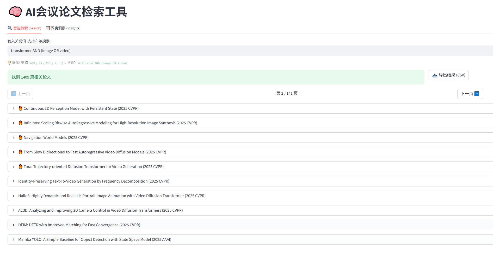
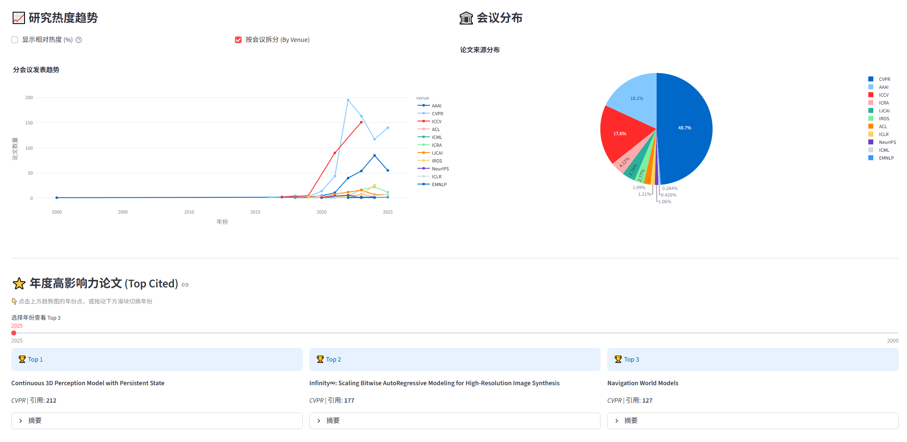

# 🧠 Research Pulse (AI 会议论文检索工具)

Research Pulse 是一个用于检索和分析 AI 顶级会议论文的智能工具。它集成了数据抓取、布尔搜索、多维筛选和可视化分析功能，帮助研究人员快速发现领域内的热门趋势和高影响力论文。

> **⚠️ 注意**：本项目开源部分仅包含**数据检索与分析**的核心功能代码。鉴于相关法律法规及合规性要求，数据抓取（Crawler）工具不开源。项目所需的数据由外部托管并定期更新。

## ✨ 主要功能

-   **🔍 智能检索**: 支持高级布尔查询语法（AND, OR, NOT, *, ()），例如 `diffusion AND (image OR video)`。
-   **🛠️ 多维筛选**: 可按年份、会议 (Venue)、引用数进行精确过滤。
-   **📈 深度洞察**: 提供可视化图表，分析特定主题的研究热度趋势、会议分布，并识别年度高引用论文。
-   **📥 数据导出**: 支持将搜索结果导出为 CSV 文件。

## 🖼️ 功能展示

以下为核心页面示例



## 📂 项目结构

```
research-pulse/
├── app.py                  # Streamlit 主应用程序入口
├── data_manager.py         # 数据加载、缓存与筛选逻辑
├── search_engine.py        # 布尔搜索引擎实现 (支持中缀转后缀表达式解析)
├── concept_search.py       # (实验性) 基于 TF-IDF 的语义搜索实现
├── pyproject.toml          # 项目依赖配置
├── README.md               # 项目说明文档
└── ai_papers_data/         # [数据目录] 存放各会议的 CSV 数据文件 (需手动下载)
    ├── NeurIPS/
    ├── ICML/
    ├── CVPR/
    └── ...
```

## 🚀 快速开始

### 1. 环境准备

确保你的系统安装了 Python 3.9 或更高版本。

推荐使用 `uv` 或 `pip` 进行依赖管理。

```bash
# 使用 pip 安装依赖
pip install streamlit pandas plotly scikit-learn
```

### 2. 获取数据

由于数据文件较大且更新频繁，我们不直接托管在 GitHub 仓库中。请通过以下方式获取最新的 AI 会议论文数据集：

1.  访问[research-pulse-data](https://pan.baidu.com/s/5aVayKbnyzeenvSjROeW1Pw)下载最新数据包。
2.  解压下载的文件。
3.  将解压后的 `ai_papers_data` 文件夹放置在项目根目录下。

> 数据集包含主要 AI 顶级会议（如 NeurIPS, CVPR, ICML, ACL 等）的历史论文元数据。我们会定期更新托管数据，请关注版本更新。

### 3. 运行应用

在数据准备就绪后，在项目根目录下运行以下命令启动 Web 界面：

```bash
streamlit run app.py
```

启动后，浏览器将自动打开 `http://localhost:8501`。

## 📝 搜索语法指南

在搜索框中，你可以使用以下语法进行精确检索：

-   **关键词**: `transformer` (匹配标题或摘要包含 transformer 的论文)
-   **逻辑与 (AND)**: `transformer AND vision` (同时包含两者)
-   **逻辑或 (OR)**: `image OR video` (包含任一即可)
-   **逻辑非 (NOT)**: `diffusion NOT stable` (包含 diffusion 但不包含 stable)
-   **括号 ()**: `(image OR video) AND generation` (优先计算括号内逻辑)
-   **通配符 \***: `embed*` (匹配 embedding, embedded, embed 等)

## 📊 数据说明

本项目使用的数据主要来源于DBLP和Semantic Scholar。数据仅供学术研究和个人学习使用。

## 🤝 贡献

欢迎提交 Issue 或 Pull Request 来改进此项目！

## ✅ TODO

- 会议论文数据补全
- 集成语义搜索改进（TF-IDF、BM25、Embedding）
- 增加论文详情页与外部链接（DBLP、Semantic Scholar、ArXiv）
- 国际化支持（中英文切换）

## © Copyright

Copyright (c) 2026 tuanzi. All rights reserved.
